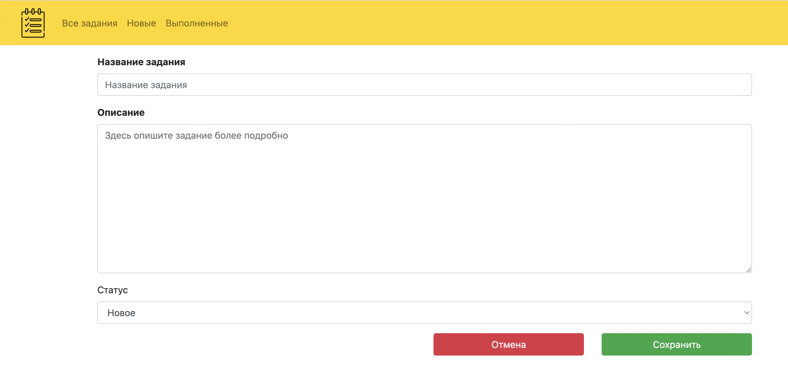
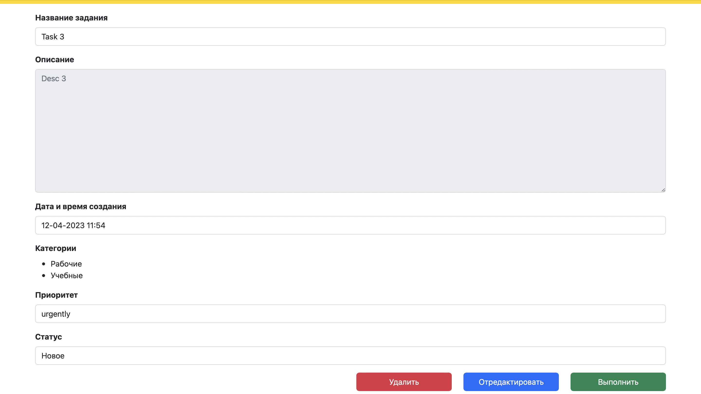

# job4j_todo

## О проекте

В этом проекте будем разрабатывать приложение "TODO список".

Из логики будет реализовано:
+ Страница со списком всех заданий с возможностью отсортировать по выполнено/новое и добавить задание.
+ Переводить задания в выполнено, редактировать и удалять их.

## Используемые технологии

+ Java 17
+ Spring boot
+ Lombok
+ Thymeleaf
+ Bootstrap
+ Hibernate
+ Liquibase
+ PostgreSql

## Требования к окружению

+ Java 17
+ Maven 3.8
+ PostgreSql 14

## Запуск

+ Cкачать проект из этого репозитория
+ Создать базу данных todo
+ Настроить соединение с базой данных
+ Запустить проект командой
``` 
mvn spring-boot:run -Pproduction
```
+ Перейти в браузере по [ссылке](http://localhost:8080/)

## Взаимодействие с приложением

#### Главная страница со списком заданий. Можно отфильтровать список по состоянию. Есть кнопка добавить новое задание.


#### Форма создания нового задания.


#### При нажатии на название задания на главной странице переходим на страницу с подробной информацией задания. Кнопка *удалить* удаляет задание из списка. Кнопка *выполнить* переводит задание в статус выполнено. Кнопка *отредактировать* открывает страницу с формой редактирования задания.


#### Форма редактирования задания.


### Контакты разработчика

:email:  rozovod.store@gmail.com