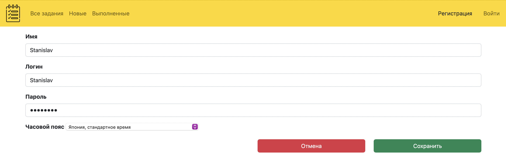
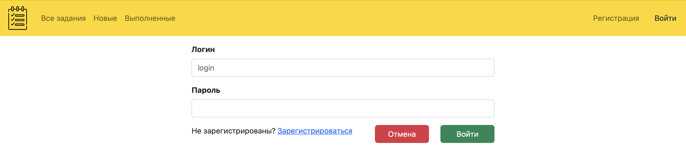
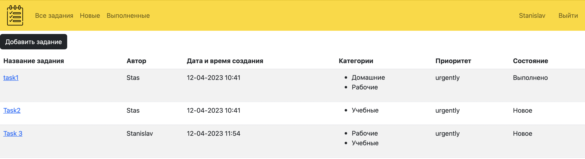
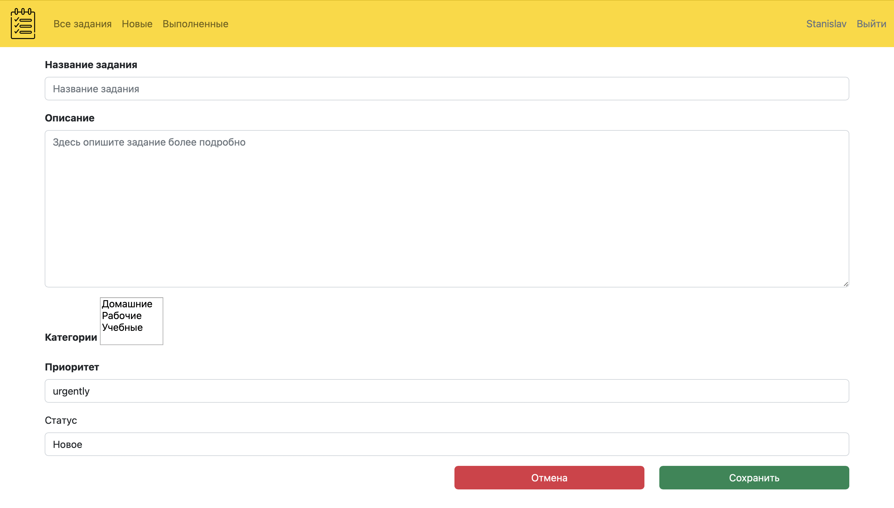
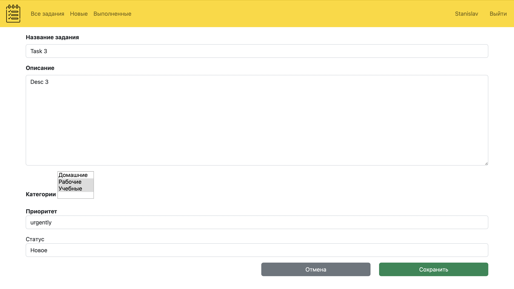

# job4j_todo

## О проекте

В этом проекте будем разрабатывать приложение "TODO список".

Из логики будет реализовано:
+ Страница со списком всех заданий с возможностью отсортировать по выполнено/новое и добавить задание.
+ Переводить задания в выполнено, редактировать и удалять их.

## Используемые технологии

+ Java 17
+ Spring boot 2.7.6
+ Lombok 1.18.22
+ Thymeleaf 3.0.15
+ Bootstrap 4.3.1
+ Hibernate 5.6.11.Final
+ Liquibase 4.15
+ PostgreSql 42.2.9

## Требования к окружению

+ Java 17
+ Maven 3.8
+ PostgreSql 14

## Запуск

+ Cкачать проект из этого репозитория
+ Создать базу данных todo
+ Настроить соединение с базой данных
+ Запустить проект командой
``` 
mvn spring-boot:run -Pproduction
```
+ Перейти в браузере по [ссылке](http://localhost:8080/task)

## Взаимодействие с приложением

#### Форма регистрации нового пользователя. Есть возможность указать часовой пояс для отображения времени с учетом указанного пояса.


#### Форма авторизации. Только авторизованный пользователь может взаимодействовать с приложением.


#### Главная страница со списком заданий. Можно отфильтровать список по состоянию. Есть кнопка добавить новое задание.


#### Форма создания нового задания.


#### При нажатии на название задания на главной странице переходим на страницу с подробной информацией задания. Кнопка *удалить* удаляет задание из списка. Кнопка *выполнить* переводит задание в статус выполнено. Кнопка *отредактировать* открывает страницу с формой редактирования задания.


#### Форма редактирования задания.


### Контакты разработчика

:email:  rozovod.store@gmail.com